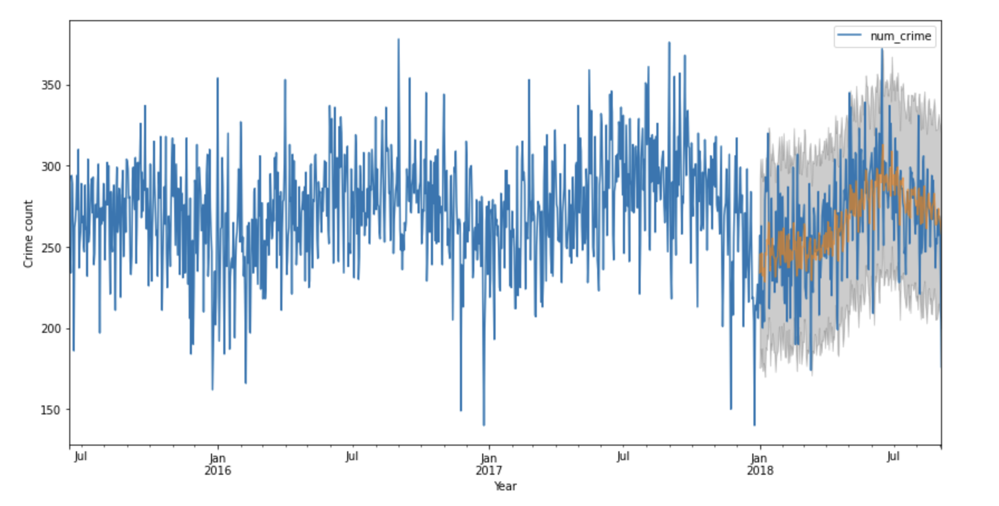
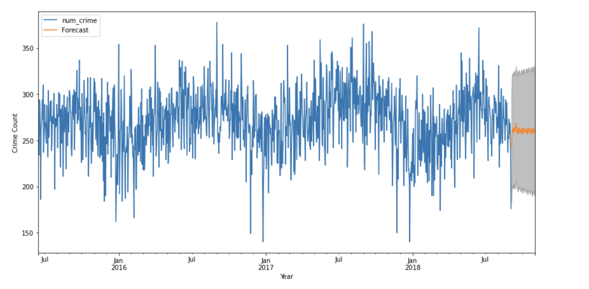

# Boston_Crime_Analysis

This project focuses on analyzing the crime in Boston from June 14, 2015, to September 18, 2018. I took my undergraduate studies at Boston University, so I am quite interested in exploring the topic of crime in Boston. Another reason is the availability of huge amounts of publicly available (high quality) crime datasets open for data scientists to mine and investigates such as this one, and This is a dataset containing records from the new crime incident report system, which includes a reduced set of fields focused on capturing the type of incident as well as when and where it occurred.

This project can show regions that have a high probability of crime occurrence (shooting), visualize crime-prone areas, and also forecast the occurrence of future crime rates. This helps to perform descriptive, predictive, and prescriptive analysis of Boston crime data.

For this project, Since the data point has over 300,000, I used Apache Spark on the DataBricks platform. I tried Spark SQL and Spark Dataframe to query and manipulate the dataset. 

### As DataBrick Notebook cannot directly put into the Github, here is the [DataBricks Notebook link](https://databricks-prod-cloudfront.cloud.databricks.com/public/4027ec902e239c93eaaa8714f173bcfc/3014812208976575/3794154026177906/8479687476525162/latest.html)

Here is some charts created in the Notebook:

